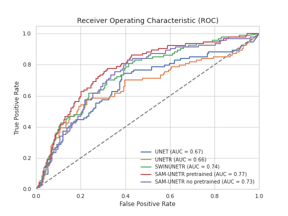

# BIMCV-SAM-UNETR

This repository contains the code of SAM-UNETR, a model that combines the [Segment Anything Model (SAM)](https://github.com/facebookresearch/segment-anything) image encoder from Meta AI with a convolutional-decoder based on UNETR. SAM-UNETR was specifically trained and evaluated for the challenging task of Clinically Significant Prostate Cancer Segmentation.


## Model Architecture

SAM-UNETR is designed to leverage the strengths of both SAM and UNETR to achieve accurate prostate cancer segmentation. The model incorporates the powerful image encoding capabilities of SAM with the effective convolutional-decoder structure of UNETR, resulting in improved segmentation performance.


## Dataset

To train and evaluate SAM-UNETR, a dataset of clinically significant prostate cancer images was used. The dataset consists of high-resolution MRI scans along with corresponding ground truth segmentation masks from [PI-CAI Challenge](https://github.com/facebookresearch/segment-anything) and [Prostate158](https://github.com/kbressem/prostate158).

## Results

SAM-UNETR achieved good results on the Clinically Significant Prostate Cancer Segmentation task. The model's performance was evaluated against other models apliying the same technique.



## Usage

To use SAM-UNETR first run [Extract_SAM_encoder_weigths.ipynb](Extract_SAM_encoder_weigths.ipynb) to save the weights of the image encoder, then run  requires `Train_model.py`  file that you want to use.
Finally `Analize_Results_model.py` contains the codes for predictions on each model

## Citing BIMCV-SAM-UNETR

BIMCV-SAM-UNETR is research software, made by a team of UMIB-FISABIO researchers. Citations and use of our software help us justify the effort which has gone into, and will keep going into, maintaining and growing this project.
If you have used BIMCV-SAM-UNETR in your research, please consider citing us:

> Alzate-Grisales, J. A., Mora-Rubio, A., García-García, F., Tabares-Soto, R., & De La Iglesia-Vayá, M. (2023). SAM-UNETR: Clinically Significant Prostate Cancer Segmentation Using Transfer Learning From Large Model.
> _IEEE Access_, 11, 118217-118228.
> https://ieeexplore.ieee.org/abstract/document/10292632

Or with BibTex:
```bibtex
@article{alzate2023sam,
  title={SAM-UNETR: Clinically Significant Prostate Cancer Segmentation Using Transfer Learning From Large Model},
  author={Alzate-Grisales, Jesus Alejandro and Mora-Rubio, Alejandro and Garcia-Garcia, Francisco and Tabares-Soto, Reinel and De La Iglesia-Vaya, Maria},
  journal={IEEE Access},
  volume={11},
  pages={118217--118228},
  year={2023},
  publisher={IEEE}
}
```
## Grants and funding
This project has received funding from R&D Missions in the Artificial Intelligence program, which is part of the Spain Digital 2025 Agenda and the National Artificial Intelligence Strategy and financed by the European Union through Next Generation EU funds (project TARTAGLIA, exp. MIA.2021.M02.0005). This project has also received funding from the Instituto de Salud Carlos III (ISCIII) Acción Estratégica en Salud, integrated in the Spanish National RCDCI Plan and financed by ISCIII Subdirección General de Evaluación and the Fondo Europeo de Desarrollo Regional (FEDER–Una manera de hacer Europa) grant PI19/00335 awarded to MM, grant PI17/01474 awarded to MB, grants AC17/00100, PI19/01301, and PI22/01403 awarded to AR and by the European Union Joint Programme–Neurodegenerative Disease Research (JPND) Multinational research projects on Personalized Medicine for Neurodegenerative Diseases/Instituto de Salud Carlos III grant AC19/00097 awarded to AR and grant FI20/00215 from the Instituto de Salud Carlos III (ISCIII) awarded to IR. For CSF biomarker research, AR and MB received support from the European Union/EFPIA Innovative Medicines Initiative Joint undertaking ADAPTED and MOPEAD projects (grant numbers 115975 and 115985, respectively). AC received support from the Instituto de Salud Carlos III (ISCIII) under the grant Sara Borrell (CD22/00125) and the Spanish Ministry of Science and Innovation, Proyectos de Generación de Conocimiento grant PID2021-122473OA-I00.
